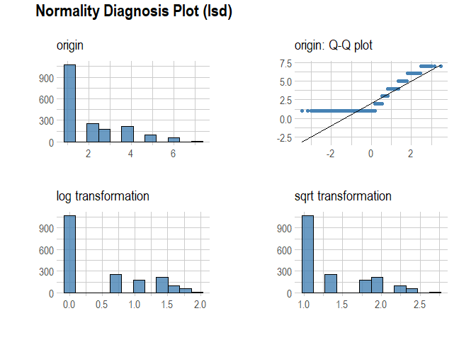
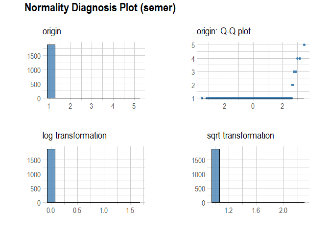

drug\_consumption
================
Nuno Fernandes & Beatriz Arcipestre
16/03/2022

### Import library

``` r
packages <- c("dplyr", "tibble", "tidyr", "purrr", "FactoMineR", "ggplot2", "lm.beta", "olsrr", "rcompanion", "FSA", "caret", "tidyverse", "reticulate", "factoextra", "MASS", "ggeffects", "effects", "rio", "foreign", "Hmisc","reshape2", "misty", "lavaan", "semPlot", "sjPlot","dlookr","PerformanceAnalytics","lubridate")

installed_packages <- packages %in% row.names(installed.packages())
if (any(installed_packages == FALSE)) {
  install.packages(packages[!installed.packages])
}

lapply(packages, library, character.only = TRUE)
```

### set wd

``` r
setwd("~/2021/Artigo_Covid-19_Daniela")
```

### read txt

``` r
df = read.delim2("drug_consumption.txt",sep = ",")
```

### recode independent variables

``` r
df %>% mutate(age=recode(age, '-0.07854'='25-34',"-0.95197"="18-24", "0.49788" = " 35-44","1.09449" = "45-54", "1.82213" = "55-64", "2.59171" = "65+"),
              
              gender=recode(gender, '0.48246'='female', '-0.48246'='male'),
              
              education=recode(education, "-0.05921" = "Professional certificate/diploma", "-0.61113" = "Some college or university, no certificate or degree", "-1.22751" = " Left school at 18 years", "-1.43719" = "Left school at 17 years", "-1.73790" = "Left school at 16 years ", "-2.43591" = "Left school before 16 years", "0.45468" = "University degree", "1.16365" = "Masters degree",  "1.98437" = "Doctorate degree"),
              
              country = recode(country, "-0.09765" = "Australia", "-0.28519"="Other", "-0.46841" = "New Zealand", "-0.57009" = "USA",  "0.21128" = "Republic of Ireland",  "0.24923" = "Canada",  "0.96082" = "UK"),
              
              ethnicity = recode(ethnicity, "-0.22166" = "Mixed-White/Black", "-0.31685" = "White", "-0.50212" = "Asian", "-1.10702" = "Black",  "0.11440" = "Other",  "0.12600" = "Mixed-White/Asian",  "1.90725" = "Mixed-Black/Asian"),
              
              neuroticism = recode(neuroticism,"-0.05188" = 35, "-0.14882" = 34, "-0.24649" = 33, "-0.34799" = 32, "-0.46725" = 31, "-0.58016" = 30, "-0.67825" = 29, "-0.79151" = 28, "-0.92104" = 27, "-1.05308" = 26, "-1.19430" = 25, "-1.32828" = 24, "-1.43907" = 23, "-1.55078" = 22, "-1.69163" = 21, "-1.86962" = 20,
 "-2.05048" = 19, "-2.21844" = 18, "-2.34360" = 17, "-2.42317" = 16, "-2.52197" = 15, "-2.75696" = 14, "-3.15735" = 13, "-3.46436" = 12,
 "0.04257" = 36,  "0.13606" = 37,  "0.22393" = 38,  "0.31287" = 39,  "0.41667" = 40,  "0.52135" = 41,  "0.62967" = 42,  "0.73545" = 43, 
"0.82562" = 44,  "0.91093" = 45,  "1.02119" = 46,  "1.13281" = 47,  "1.23461" = 48,  "1.37297" = 49,  "1.49158" = 50,  "1.60383" = 51, 
 "1.72012" = 52,  "1.83990" = 53,  "1.98437" = 54,  "2.12700" = 55,  "2.28554" = 56,  "2.46262" = 57,  "2.61139" = 58,  "2.82196" = 59, 
"3.27393"=60),

              extraversion = recode(extraversion,"-0.15487" = 39, "-0.30033" = 38, "-0.43999" = 37, "-0.57545" = 36, "-0.69509" = 35, "-0.80615" = 34, "-0.94779" = 33, "-1.09207" = 32,
"-1.23177" = 31, "-1.37639" = 30, "-1.50796" = 29, "-1.63340" = 28, "-1.76250" = 27, "-1.92173" = 26, "-2.03972" = 25, "-2.11437" = 24, "-2.21069" = 23, "-2.32338" = 22, "-2.44904" = 21, "-2.53830" = 20, "-2.72827" = 19, "-3.00537" = 18, "-3.27393" = 16, "0.00332" = 40, "0.16767" = 41,  "0.32197" = 42,  "0.47617" = 43,  "0.63779" = 44,  "0.80523" = 45,  "0.96248" = 46,  "1.11406" = 47,  "1.28610" = 48, "1.45421" = 49,  "1.58487" =50,  "1.74091" = 51,  "1.93886" = 52, "2.12700" = 53 , "2.32338" = 54,  "2.57309" = 55,  "2.85950" = 56 , "3.00537" = 57 , "3.27393" = 58 ),
              
              openness = recode(openness, "-0.01928" =  46,"-0.17779" = 45 ,"-0.31776" = 44 ,"-0.45174" = 43, "-0.58331" =  42,"-0.71727" = 41 ,"-0.84732" = 40,"-0.97631" = 39, "-1.11902" = 38,"-1.27553" = 37,"-1.42424" = 36 ,"-1.55521" = 35,"-1.68062" = 34,"-1.82919" = 33 ,"-1.97495" = 32 ,"-2.09015" = 31 ,"-2.21069" = 30, "-2.39883" = 29, "-2.63199" = 28,"-2.85950" = 26,"-3.27393" = 24 ,"0.14143" = 47 ,"0.29338" = 48 ,"0.44585" = 49 ,"0.58331" =50 ,"0.72330" = 51  ,"0.88309" = 52  ,"1.06238" = 53  ,"1.24033" = 54  ,"1.43533" = 55  ,"1.65653" = 56 ,"1.88511" = 57 ,"2.15324" =58  ,"2.44904" = 59  ,"2.90161" = 60 ),
              
              agreeableness = recode(agreeableness, "-0.01729" = 43, "-0.15487" = 42, "-0.30172" = 41, "-0.45321" = 40, "-0.60633" = 39, "-0.76096" = 38, "-0.91699" = 37, "-1.07533" = 36, "-1.21213" = 35, "-1.34289" = 34, "-1.47955" = 33, "-1.62090" = 32, "-1.77200" = 31, "-1.92595" = 30, "-2.07848" = 29, "-2.21844" = 28, "-2.35413" = 27, "-2.53830" = 26, "-2.70172" = 25, "-2.78793" = 24,"-2.90161" = 23, "-3.00537" = 18, "-3.15735" = 16, "-3.46436" = 12, "0.13136" = 44, "0.28783" = 45,  "0.43852" = 46 ,"0.59042" = 47,  "0.76096" = 48,  "0.94156" = 49, "1.11406" = 50,  "1.28610" = 51,  "1.45039" = 52,  "1.61108" = 53,  "1.81866" = 54,"2.03972" = 55,  "2.23427" =56, "2.46262" = 57,  "2.75696" = 58,  "3.15735" = 59 , "3.46436" = 60),

              conscientiousness = recode(conscientiousness, "-0.00665" = 42, "-0.14277" = 41, "-0.27607" = 40, "-0.40581" = 39, "-0.52745" = 38, "-0.65253" = 37, "-0.78155" = 36, "-0.89891" = 35, "-1.01450" = 34, "-1.13788" = 33, "-1.25773" = 32, "-1.38502" = 31, "-1.51840" = 30, "-1.64101" = 29, "-1.78169" = 28, "-1.92173" = 27, "-2.04506" = 26, "-2.18109" = 25, "-2.30408" = 24, "-2.42317" = 23, "-2.57309" = 22, "-2.72827" = 21, "-2.90161" = 20, "-3.15735" = 19, "-3.46436" = 17, "0.12331" = 43,  "0.25953" = 44,  "0.41594" = 45,  "0.58489" = 46, "0.75830" = 47,  "0.93949" = 48,  "1.13407" = 49,  "1.30612" = 50,  "1.46191" = 51, "1.63088" = 52, "1.81175" = 53, "2.04506" = 54, "2.33337" = 55, "2.63199" = 56, "3.00537" = 57, "3.46436" = 58)

              ) ->df
```

# recode depedent variables (7-point Likert scale)

``` r
df[,14:32] = apply(df[14:32], MARGIN =2, 
                   function(x) recode(x, "CL0" = 1, "CL1" = 2, "CL2" = 3, "CL3" = 4, "CL4" = 5, "CL5" = 6, "CL6" = 7))
```

# drop impulsiveness & sensation (missing the original vals)

``` r
df = df[,-c(13,12)]
```

# EDA

``` r
str(df)
```

    ## 'data.frame':    1885 obs. of  30 variables:
    ##  $ ID               : int  1 2 3 4 5 6 7 8 9 10 ...
    ##  $ age              : chr  " 35-44" "25-34" " 35-44" "18-24" ...
    ##  $ gender           : chr  "female" "male" "male" "female" ...
    ##  $ education        : chr  "Professional certificate/diploma" "Doctorate degree" "Professional certificate/diploma" "Masters degree" ...
    ##  $ country          : chr  "UK" "UK" "UK" "UK" ...
    ##  $ ethnicity        : chr  "Mixed-White/Asian" "White" "White" "White" ...
    ##  $ neuroticism      : num  39 29 31 34 43 29 31 24 42 33 ...
    ##  $ extraversion     : num  36 52 45 34 28 38 32 52 55 40 ...
    ##  $ openness         : num  42 55 40 46 43 35 43 40 39 36 ...
    ##  $ agreeableness    : num  37 48 32 47 41 55 41 41 48 47 ...
    ##  $ conscientiousness: num  42 41 34 46 50 52 48 52 49 43 ...
    ##  $ alcohol          : num  6 6 7 5 5 3 7 6 5 7 ...
    ##  $ amphet           : num  3 3 1 1 2 1 1 1 1 2 ...
    ##  $ amyl             : num  1 3 1 1 2 1 1 1 1 1 ...
    ##  $ benzos           : num  3 1 1 4 1 1 1 1 1 2 ...
    ##  $ caff             : num  7 7 7 6 7 7 7 7 7 7 ...
    ##  $ cannabis         : num  1 5 4 3 4 1 2 1 1 2 ...
    ##  $ choc             : num  6 7 5 5 7 5 6 5 7 7 ...
    ##  $ coke             : num  1 4 1 3 1 1 1 1 1 1 ...
    ##  $ crack            : num  1 1 1 1 1 1 1 1 1 1 ...
    ##  $ ecstasy          : num  1 5 1 1 2 1 1 1 1 1 ...
    ##  $ heroin           : num  1 1 1 1 1 1 1 1 1 1 ...
    ##  $ ketamine         : num  1 3 1 3 1 1 1 1 1 1 ...
    ##  $ legalh           : num  1 1 1 1 2 1 1 1 1 1 ...
    ##  $ lsd              : num  1 3 1 1 1 1 1 1 1 1 ...
    ##  $ meth             : num  1 4 1 1 1 1 1 1 1 1 ...
    ##  $ mushrooms        : num  1 1 2 1 3 1 1 1 1 1 ...
    ##  $ nicotine         : num  3 5 1 3 3 7 7 1 7 7 ...
    ##  $ semer            : num  1 1 1 1 1 1 1 1 1 1 ...
    ##  $ vsa              : num  1 1 1 1 1 1 1 1 1 1 ...

# EDA

``` r
describe(df)
```

    ## # A tibble: 25 x 26
    ##    variable          n    na   mean     sd se_mean   IQR skewness kurtosis   p00
    ##    <chr>         <int> <int>  <dbl>  <dbl>   <dbl> <dbl>    <dbl>    <dbl> <dbl>
    ##  1 ID             1885     0 945.   545.   12.6      943 -0.00257  -1.20       1
    ##  2 neuroticism    1885     0  35.9    9.14  0.210     13  0.116    -0.548     12
    ##  3 extraversion   1885     0  39.6    6.77  0.156      9 -0.279     0.0487    16
    ##  4 openness       1885     0  45.8    6.58  0.152     10 -0.300    -0.273     24
    ##  5 agreeableness  1885     0  42.9    6.44  0.148      9 -0.270     0.135     12
    ##  6 conscientiou~  1885     0  41.4    6.97  0.160      9 -0.389    -0.167     17
    ##  7 alcohol        1885     0   5.64   1.33  0.0307     2 -1.32      1.77       1
    ##  8 amphet         1885     0   2.34   1.78  0.0411     2  1.25      0.545      1
    ##  9 amyl           1885     0   1.61   1.06  0.0245     1  1.86      3.23       1
    ## 10 benzos         1885     0   2.47   1.87  0.0430     3  1.00     -0.194      1
    ## # ... with 15 more rows, and 16 more variables: p01 <dbl>, p05 <dbl>,
    ## #   p10 <dbl>, p20 <dbl>, p25 <dbl>, p30 <dbl>, p40 <dbl>, p50 <dbl>,
    ## #   p60 <dbl>, p70 <dbl>, p75 <dbl>, p80 <dbl>, p90 <dbl>, p95 <dbl>,
    ## #   p99 <dbl>, p100 <dbl>

``` r
normality(df)
```

    ## # A tibble: 25 x 4
    ##    vars              statistic  p_value sample
    ##    <chr>                 <dbl>    <dbl>  <dbl>
    ##  1 ID                    0.955 1.10e-23   1885
    ##  2 neuroticism           0.992 2.10e- 8   1885
    ##  3 extraversion          0.993 6.74e- 8   1885
    ##  4 openness              0.989 6.72e-11   1885
    ##  5 agreeableness         0.993 3.87e- 8   1885
    ##  6 conscientiousness     0.986 1.74e-12   1885
    ##  7 alcohol               0.829 6.51e-41   1885
    ##  8 amphet                0.758 2.87e-46   1885
    ##  9 amyl                  0.631 3.80e-53   1885
    ## 10 benzos                0.771 2.36e-45   1885
    ## # ... with 15 more rows

``` r
plot_normality(df) 
```

<!-- --><!-- --><!-- --><!-- --><!-- --><!-- --><!-- --><!-- --><!-- --><!-- --><!-- --><!-- --><!-- --><!-- --><!-- --><!-- --><!-- --><!-- --><!-- --><!-- --><!-- --><!-- --><!-- --><!-- --><!-- -->

\#df with NEO-PI-R dimension

``` r
df_iv = df[,7:11]
```

\#df with type of drug consumption

``` r
df_dv = df[,12:30]
```

``` r
library("PerformanceAnalytics")

chart.Correlation(df_iv, histogram=TRUE, pch=19)
```

<!-- -->

``` r
library(psych)
```

    ## 
    ## Attaching package: 'psych'

    ## The following object is masked from 'package:dlookr':
    ## 
    ##     describe

    ## The following object is masked from 'package:lavaan':
    ## 
    ##     cor2cov

    ## The following object is masked from 'package:Hmisc':
    ## 
    ##     describe

    ## The following object is masked from 'package:FSA':
    ## 
    ##     headtail

    ## The following object is masked from 'package:rcompanion':
    ## 
    ##     phi

    ## The following objects are masked from 'package:ggplot2':
    ## 
    ##     %+%, alpha

``` r
corPlot(df_dv, cex = 0.4)
```

<!-- -->

\#PCA iv

``` r
pca <- PCA(df_iv, graph=F)

get_eig(pca)
```

    ##       eigenvalue variance.percent cumulative.variance.percent
    ## Dim.1  1.9211326        38.422653                    38.42265
    ## Dim.2  1.1082191        22.164382                    60.58703
    ## Dim.3  0.8664498        17.328995                    77.91603
    ## Dim.4  0.6072213        12.144426                    90.06046
    ## Dim.5  0.4969772         9.939544                   100.00000

``` r
fviz_screeplot(pca, addlabels = TRUE, ylim = c(0, 50))
```

<!-- -->

``` r
var <- get_pca_var(pca)

fviz_pca_var(pca, col.var="contrib",
             gradient.cols = c("#00AFBB", "#E7B800", "#FC4E07"),
             repel = TRUE 
)
```

<!-- -->

``` r
summary(pca,nbelements = 20, ncp = 4)
```

    ## 
    ## Call:
    ## PCA(X = df_iv, graph = F) 
    ## 
    ## 
    ## Eigenvalues
    ##                        Dim.1   Dim.2   Dim.3   Dim.4   Dim.5
    ## Variance               1.921   1.108   0.866   0.607   0.497
    ## % of var.             38.423  22.164  17.329  12.144   9.940
    ## Cumulative % of var.  38.423  60.587  77.916  90.060 100.000
    ## 
    ## Individuals (the 20 first)
    ##                       Dist    Dim.1    ctr   cos2    Dim.2    ctr   cos2  
    ## 1                 |  1.248 | -0.818  0.018  0.430 | -0.526  0.013  0.178 |
    ## 2                 |  2.561 |  1.800  0.090  0.494 |  1.657  0.131  0.419 |
    ## 3                 |  2.386 | -0.535  0.008  0.050 | -0.006  0.000  0.000 |
    ## 4                 |  1.252 |  0.257  0.002  0.042 | -0.558  0.015  0.199 |
    ## 5                 |  2.302 | -0.853  0.020  0.137 | -1.161  0.065  0.254 |
    ## 6                 |  3.027 |  1.597  0.070  0.278 | -2.319  0.257  0.587 |
    ## 7                 |  1.641 |  0.043  0.000  0.001 | -1.043  0.052  0.404 |
    ## 8                 |  2.869 |  2.283  0.144  0.634 | -0.699  0.023  0.059 |
    ## 9                 |  2.918 |  1.582  0.069  0.294 | -0.470  0.011  0.026 |
    ## 10                |  1.665 |  0.405  0.005  0.059 | -1.476  0.104  0.786 |
    ## 11                |  2.558 |  1.486  0.061  0.337 | -1.261  0.076  0.243 |
    ## 12                |  2.446 | -0.206  0.001  0.007 |  0.458  0.010  0.035 |
    ## 13                |  2.929 | -2.077  0.119  0.503 |  1.252  0.075  0.183 |
    ## 14                |  2.822 |  2.486  0.171  0.776 | -0.629  0.019  0.050 |
    ## 15                |  2.408 |  1.896  0.099  0.620 |  0.434  0.009  0.032 |
    ## 16                |  3.297 |  0.201  0.001  0.004 | -2.349  0.264  0.508 |
    ## 17                |  2.636 |  0.756  0.016  0.082 | -2.313  0.256  0.770 |
    ## 18                |  2.105 | -1.944  0.104  0.853 | -0.099  0.000  0.002 |
    ## 19                |  2.960 | -2.430  0.163  0.674 |  0.816  0.032  0.076 |
    ## 20                |  3.843 | -1.331  0.049  0.120 | -2.848  0.388  0.549 |
    ##                    Dim.3    ctr   cos2    Dim.4    ctr   cos2  
    ## 1                 -0.690  0.029  0.306 |  0.366  0.012  0.086 |
    ## 2                  0.266  0.004  0.011 | -0.599  0.031  0.055 |
    ## 3                 -1.960  0.235  0.675 | -1.175  0.121  0.242 |
    ## 4                  0.691  0.029  0.305 |  0.495  0.021  0.156 |
    ## 5                  0.247  0.004  0.012 |  1.665  0.242  0.523 |
    ## 6                  1.100  0.074  0.132 |  0.151  0.002  0.002 |
    ## 7                 -0.266  0.004  0.026 |  0.703  0.043  0.183 |
    ## 8                 -1.425  0.124  0.247 |  0.054  0.000  0.000 |
    ## 9                 -0.001  0.000  0.000 |  0.271  0.006  0.009 |
    ## 10                 0.168  0.002  0.010 | -0.474  0.020  0.081 |
    ## 11                -1.567  0.150  0.375 |  0.508  0.023  0.039 |
    ## 12                -2.104  0.271  0.740 | -0.580  0.029  0.056 |
    ## 13                -0.782  0.037  0.071 |  0.782  0.053  0.071 |
    ## 14                 0.195  0.002  0.005 |  1.162  0.118  0.170 |
    ## 15                -1.231  0.093  0.261 |  0.703  0.043  0.085 |
    ## 16                -1.458  0.130  0.196 |  0.156  0.002  0.002 |
    ## 17                -0.318  0.006  0.015 | -0.389  0.013  0.022 |
    ## 18                 0.180  0.002  0.007 | -0.653  0.037  0.096 |
    ## 19                -1.242  0.094  0.176 | -0.289  0.007  0.010 |
    ## 20                -1.952  0.233  0.258 |  0.593  0.031  0.024 |
    ## 
    ## Variables
    ##                      Dim.1    ctr   cos2    Dim.2    ctr   cos2    Dim.3    ctr
    ## neuroticism       | -0.770 30.887  0.593 |  0.132  1.581  0.018 |  0.266  8.190
    ## extraversion      |  0.734 28.073  0.539 |  0.358 11.544  0.128 | -0.254  7.428
    ## openness          |  0.146  1.103  0.021 |  0.920 76.455  0.847 |  0.175  3.549
    ## agreeableness     |  0.506 13.314  0.256 | -0.155  2.175  0.024 |  0.833 80.139
    ## conscientiousness |  0.715 26.623  0.511 | -0.302  8.245  0.091 | -0.078  0.694
    ##                     cos2    Dim.4    ctr   cos2  
    ## neuroticism        0.071 |  0.358 21.064  0.128 |
    ## extraversion       0.064 | -0.170  4.736  0.029 |
    ## openness           0.031 |  0.195  6.237  0.038 |
    ## agreeableness      0.694 | -0.149  3.644  0.022 |
    ## conscientiousness  0.006 |  0.625 64.318  0.391 |

# PCA Drugs

``` r
df_dv = df[,12:30]
pca <- PCA(df_dv, graph=F)

get_eig(pca)
```

    ##        eigenvalue variance.percent cumulative.variance.percent
    ## Dim.1   6.0088202        31.625369                    31.62537
    ## Dim.2   1.5704084         8.265307                    39.89068
    ## Dim.3   1.2746943         6.708917                    46.59959
    ## Dim.4   1.0383003         5.464739                    52.06433
    ## Dim.5   1.0092274         5.311723                    57.37606
    ## Dim.6   0.9660206         5.084319                    62.46037
    ## Dim.7   0.8800817         4.632009                    67.09238
    ## Dim.8   0.8038943         4.231022                    71.32341
    ## Dim.9   0.7738190         4.072731                    75.39614
    ## Dim.10  0.7573369         3.985984                    79.38212
    ## Dim.11  0.5803727         3.054593                    82.43671
    ## Dim.12  0.5402779         2.843568                    85.28028
    ## Dim.13  0.5085117         2.676378                    87.95666
    ## Dim.14  0.4754047         2.502130                    90.45879
    ## Dim.15  0.4410733         2.321438                    92.78023
    ## Dim.16  0.4146969         2.182615                    94.96284
    ## Dim.17  0.3472395         1.827576                    96.79042
    ## Dim.18  0.3351969         1.764194                    98.55461
    ## Dim.19  0.2746234         1.445386                   100.00000

``` r
fviz_screeplot(pca, addlabels = TRUE, ylim = c(0, 50))
```

<!-- -->

``` r
options(ggrepel.max.overlaps = Inf) 
var <- get_pca_var(pca)

fviz_pca_var(pca, col.var="contrib",
             gradient.cols = c("#00AFBB", "#E7B800", "#FC4E07"),
             repel = TRUE, alpha = 0.3)
```

<!-- -->

``` r
summary(pca,nbelements = 20, ncp = 5)
```

    ## 
    ## Call:
    ## PCA(X = df_dv, graph = F) 
    ## 
    ## 
    ## Eigenvalues
    ##                        Dim.1   Dim.2   Dim.3   Dim.4   Dim.5   Dim.6   Dim.7
    ## Variance               6.009   1.570   1.275   1.038   1.009   0.966   0.880
    ## % of var.             31.625   8.265   6.709   5.465   5.312   5.084   4.632
    ## Cumulative % of var.  31.625  39.891  46.600  52.064  57.376  62.460  67.092
    ##                        Dim.8   Dim.9  Dim.10  Dim.11  Dim.12  Dim.13  Dim.14
    ## Variance               0.804   0.774   0.757   0.580   0.540   0.509   0.475
    ## % of var.              4.231   4.073   3.986   3.055   2.844   2.676   2.502
    ## Cumulative % of var.  71.323  75.396  79.382  82.437  85.280  87.957  90.459
    ##                       Dim.15  Dim.16  Dim.17  Dim.18  Dim.19
    ## Variance               0.441   0.415   0.347   0.335   0.275
    ## % of var.              2.321   2.183   1.828   1.764   1.445
    ## Cumulative % of var.  92.780  94.963  96.790  98.555 100.000
    ## 
    ## Individuals (the 20 first)
    ##               Dist    Dim.1    ctr   cos2    Dim.2    ctr   cos2    Dim.3
    ## 1         |  2.588 | -1.990  0.035  0.592 | -0.500  0.008  0.037 |  0.625
    ## 2         |  3.617 |  1.259  0.014  0.121 |  1.041  0.037  0.083 |  1.197
    ## 3         |  2.970 | -2.152  0.041  0.525 |  0.189  0.001  0.004 | -0.014
    ## 4         |  2.868 | -1.124  0.011  0.154 | -0.574  0.011  0.040 | -0.383
    ## 5         |  2.137 | -1.194  0.013  0.312 |  0.689  0.016  0.104 |  0.180
    ## 6         |  3.691 | -2.219  0.043  0.361 | -0.713  0.017  0.037 | -0.630
    ## 7         |  2.963 | -2.076  0.038  0.491 |  0.249  0.002  0.007 |  0.930
    ## 8         |  3.193 | -2.750  0.067  0.742 | -0.365  0.004  0.013 | -0.004
    ## 9         |  3.094 | -2.273  0.046  0.539 | -0.078  0.000  0.001 |  0.689
    ## 10        |  2.892 | -1.812  0.029  0.393 |  0.210  0.001  0.005 |  1.358
    ## 11        |  2.411 | -1.584  0.022  0.432 |  0.064  0.000  0.001 |  0.850
    ## 12        |  2.448 |  0.017  0.000  0.000 |  1.085  0.040  0.196 |  0.110
    ## 13        |  2.405 | -0.388  0.001  0.026 | -0.412  0.006  0.029 |  0.558
    ## 14        |  6.130 | -2.576  0.059  0.177 | -1.686  0.096  0.076 | -3.078
    ## 15        |  3.225 | -2.245  0.044  0.485 |  0.299  0.003  0.009 |  1.328
    ## 16        |  2.880 | -1.417  0.018  0.242 |  0.330  0.004  0.013 |  1.067
    ## 17        |  2.733 | -1.681  0.025  0.378 |  0.258  0.002  0.009 |  0.876
    ## 18        |  2.983 |  0.112  0.000  0.001 |  1.370  0.063  0.211 |  0.373
    ## 19        |  2.409 | -0.335  0.001  0.019 |  0.701  0.017  0.085 |  0.680
    ## 20        |  4.075 | -1.460  0.019  0.128 | -1.585  0.085  0.151 |  0.450
    ##              ctr   cos2    Dim.4    ctr   cos2    Dim.5    ctr   cos2  
    ## 1          0.016  0.058 | -0.069  0.000  0.001 |  0.147  0.001  0.003 |
    ## 2          0.060  0.109 | -0.637  0.021  0.031 | -0.547  0.016  0.023 |
    ## 3          0.000  0.000 | -0.297  0.005  0.010 |  0.553  0.016  0.035 |
    ## 4          0.006  0.018 | -1.169  0.070  0.166 | -0.164  0.001  0.003 |
    ## 5          0.001  0.007 |  0.483  0.012  0.051 | -0.178  0.002  0.007 |
    ## 6          0.016  0.029 |  0.141  0.001  0.001 |  0.310  0.005  0.007 |
    ## 7          0.036  0.098 |  0.160  0.001  0.003 |  0.685  0.025  0.053 |
    ## 8          0.000  0.000 | -0.635  0.021  0.040 |  0.381  0.008  0.014 |
    ## 9          0.020  0.050 |  0.652  0.022  0.044 |  0.251  0.003  0.007 |
    ## 10         0.077  0.221 |  0.558  0.016  0.037 |  0.431  0.010  0.022 |
    ## 11         0.030  0.124 | -0.544  0.015  0.051 |  0.491  0.013  0.042 |
    ## 12         0.000  0.002 |  0.492  0.012  0.040 |  0.380  0.008  0.024 |
    ## 13         0.013  0.054 |  0.843  0.036  0.123 |  0.356  0.007  0.022 |
    ## 14         0.394  0.252 | -1.895  0.184  0.096 |  0.256  0.003  0.002 |
    ## 15         0.073  0.170 |  0.418  0.009  0.017 |  0.519  0.014  0.026 |
    ## 16         0.047  0.137 | -1.440  0.106  0.250 | -0.158  0.001  0.003 |
    ## 17         0.032  0.103 |  0.423  0.009  0.024 |  0.661  0.023  0.059 |
    ## 18         0.006  0.016 | -0.616  0.019  0.043 |  0.552  0.016  0.034 |
    ## 19         0.019  0.080 |  0.356  0.006  0.022 | -0.204  0.002  0.007 |
    ## 20         0.008  0.012 |  1.185  0.072  0.085 | -0.461  0.011  0.013 |
    ## 
    ## Variables
    ##              Dim.1    ctr   cos2    Dim.2    ctr   cos2    Dim.3    ctr   cos2
    ## alcohol   |  0.045  0.034  0.002 |  0.315  6.300  0.099 |  0.480 18.073  0.230
    ## amphet    |  0.724  8.725  0.524 | -0.045  0.127  0.002 |  0.053  0.224  0.003
    ## amyl      |  0.422  2.962  0.178 |  0.260  4.320  0.068 |  0.326  8.327  0.106
    ## benzos    |  0.637  6.744  0.405 | -0.347  7.657  0.120 |  0.131  1.356  0.017
    ## caff      |  0.076  0.096  0.006 |  0.120  0.919  0.014 |  0.620 30.131  0.384
    ## cannabis  |  0.718  8.578  0.515 |  0.225  3.232  0.051 | -0.150  1.775  0.023
    ## choc      | -0.108  0.196  0.012 |  0.176  1.981  0.031 |  0.418 13.698  0.175
    ## coke      |  0.745  9.240  0.555 | -0.012  0.009  0.000 |  0.188  2.784  0.035
    ## crack     |  0.500  4.153  0.250 | -0.510 16.582  0.260 |  0.104  0.855  0.011
    ## ecstasy   |  0.764  9.718  0.584 |  0.307  6.015  0.094 | -0.050  0.195  0.002
    ## heroin    |  0.550  5.041  0.303 | -0.567 20.464  0.321 |  0.111  0.962  0.012
    ## ketamine  |  0.601  6.005  0.361 |  0.224  3.200  0.050 |  0.021  0.035  0.000
    ## legalh    |  0.703  8.216  0.494 |  0.211  2.823  0.044 | -0.148  1.726  0.022
    ## lsd       |  0.688  7.867  0.473 |  0.219  3.044  0.048 | -0.308  7.451  0.095
    ## meth      |  0.543  4.905  0.295 | -0.527 17.705  0.278 |  0.030  0.071  0.001
    ## mushrooms |  0.718  8.574  0.515 |  0.237  3.569  0.056 | -0.256  5.147  0.066
    ## nicotine  |  0.565  5.306  0.319 |  0.109  0.762  0.012 |  0.151  1.790  0.023
    ## semer     |  0.073  0.089  0.005 |  0.040  0.103  0.002 | -0.261  5.329  0.068
    ## vsa       |  0.462  3.551  0.213 | -0.137  1.189  0.019 |  0.030  0.072  0.001
    ##              Dim.4    ctr   cos2    Dim.5    ctr   cos2  
    ## alcohol   | -0.159  2.433  0.025 |  0.179  3.185  0.032 |
    ## amphet    | -0.015  0.021  0.000 | -0.109  1.184  0.012 |
    ## amyl      | -0.505 24.561  0.255 | -0.100  0.985  0.010 |
    ## benzos    |  0.064  0.397  0.004 | -0.055  0.302  0.003 |
    ## caff      |  0.351 11.896  0.124 |  0.334 11.032  0.111 |
    ## cannabis  |  0.267  6.892  0.072 |  0.006  0.004  0.000 |
    ## choc      |  0.413 16.463  0.171 | -0.179  3.168  0.032 |
    ## coke      | -0.225  4.878  0.051 | -0.009  0.008  0.000 |
    ## crack     | -0.185  3.312  0.034 |  0.109  1.167  0.012 |
    ## ecstasy   | -0.088  0.745  0.008 | -0.096  0.907  0.009 |
    ## heroin    | -0.089  0.756  0.008 |  0.017  0.029  0.000 |
    ## ketamine  | -0.324 10.132  0.105 | -0.079  0.618  0.006 |
    ## legalh    |  0.135  1.744  0.018 | -0.116  1.334  0.013 |
    ## lsd       |  0.161  2.488  0.026 |  0.011  0.011  0.000 |
    ## meth      |  0.233  5.213  0.054 | -0.088  0.770  0.008 |
    ## mushrooms |  0.166  2.641  0.027 |  0.044  0.192  0.002 |
    ## nicotine  |  0.174  2.920  0.030 |  0.134  1.771  0.018 |
    ## semer     | -0.124  1.478  0.015 |  0.822 66.916  0.675 |
    ## vsa       |  0.103  1.030  0.011 |  0.254  6.417  0.065 |

# CFA

``` r
model<-'
soft_drugs=~amphet + amyl + benzos + cannabis + coke + ecstasy + ketamine + legalh + lsd +  mushrooms  + nicotine + vsa
legal_drugs=~choc + alcohol + caff
hard_drugs=~crack + heroin + meth'

fit<- cfa(model, data=df_dv)
summary(fit, fit.measures=T,standardized=T)
```

    ## lavaan 0.6-8 ended normally after 60 iterations
    ## 
    ##   Estimator                                         ML
    ##   Optimization method                           NLMINB
    ##   Number of model parameters                        39
    ##                                                       
    ##   Number of observations                          1885
    ##                                                       
    ## Model Test User Model:
    ##                                                       
    ##   Test statistic                              2008.742
    ##   Degrees of freedom                               132
    ##   P-value (Chi-square)                           0.000
    ## 
    ## Model Test Baseline Model:
    ## 
    ##   Test statistic                             11466.097
    ##   Degrees of freedom                               153
    ##   P-value                                        0.000
    ## 
    ## User Model versus Baseline Model:
    ## 
    ##   Comparative Fit Index (CFI)                    0.834
    ##   Tucker-Lewis Index (TLI)                       0.808
    ## 
    ## Loglikelihood and Information Criteria:
    ## 
    ##   Loglikelihood user model (H0)             -55183.480
    ##   Loglikelihood unrestricted model (H1)     -54179.109
    ##                                                       
    ##   Akaike (AIC)                              110444.961
    ##   Bayesian (BIC)                            110661.086
    ##   Sample-size adjusted Bayesian (BIC)       110537.184
    ## 
    ## Root Mean Square Error of Approximation:
    ## 
    ##   RMSEA                                          0.087
    ##   90 Percent confidence interval - lower         0.084
    ##   90 Percent confidence interval - upper         0.090
    ##   P-value RMSEA <= 0.05                          0.000
    ## 
    ## Standardized Root Mean Square Residual:
    ## 
    ##   SRMR                                           0.062
    ## 
    ## Parameter Estimates:
    ## 
    ##   Standard errors                             Standard
    ##   Information                                 Expected
    ##   Information saturated (h1) model          Structured
    ## 
    ## Latent Variables:
    ##                    Estimate  Std.Err  z-value  P(>|z|)   Std.lv  Std.all
    ##   soft_drugs =~                                                         
    ##     amphet            1.000                               1.219    0.683
    ##     amyl              0.346    0.021   16.134    0.000    0.422    0.397
    ##     benzos            0.843    0.038   22.101    0.000    1.028    0.551
    ##     cannabis          1.340    0.048   28.122    0.000    1.633    0.714
    ##     coke              0.874    0.031   27.764    0.000    1.065    0.704
    ##     ecstasy           1.055    0.035   30.440    0.000    1.286    0.780
    ##     ketamine          0.577    0.025   23.061    0.000    0.703    0.576
    ##     legalh            1.018    0.037   27.388    0.000    1.241    0.694
    ##     lsd               0.839    0.031   27.115    0.000    1.023    0.686
    ##     mushrooms         0.862    0.031   28.206    0.000    1.050    0.716
    ##     nicotine          1.039    0.049   21.118    0.000    1.266    0.525
    ##     vsa               0.314    0.019   16.197    0.000    0.383    0.398
    ##   legal_drugs =~                                                        
    ##     choc              1.000                               0.237    0.218
    ##     alcohol           1.905    0.545    3.494    0.000    0.451    0.339
    ##     caff              1.823    0.548    3.326    0.001    0.432    0.388
    ##   hard_drugs =~                                                         
    ##     crack             1.000                               0.543    0.649
    ##     heroin            1.469    0.066   22.263    0.000    0.797    0.771
    ##     meth              1.888    0.092   20.572    0.000    1.025    0.623
    ## 
    ## Covariances:
    ##                    Estimate  Std.Err  z-value  P(>|z|)   Std.lv  Std.all
    ##   soft_drugs ~~                                                         
    ##     legal_drugs       0.026    0.015    1.780    0.075    0.092    0.092
    ##     hard_drugs        0.401    0.026   15.341    0.000    0.606    0.606
    ##   legal_drugs ~~                                                        
    ##     hard_drugs       -0.014    0.007   -1.863    0.062   -0.107   -0.107
    ## 
    ## Variances:
    ##                    Estimate  Std.Err  z-value  P(>|z|)   Std.lv  Std.all
    ##    .amphet            1.695    0.061   27.821    0.000    1.695    0.533
    ##    .amyl              0.954    0.032   30.089    0.000    0.954    0.843
    ##    .benzos            2.429    0.083   29.275    0.000    2.429    0.697
    ##    .cannabis          2.563    0.094   27.279    0.000    2.563    0.490
    ##    .coke              1.154    0.042   27.470    0.000    1.154    0.504
    ##    .ecstasy           1.060    0.041   25.566    0.000    1.060    0.391
    ##    .ketamine          0.994    0.034   29.072    0.000    0.994    0.668
    ##    .legalh            1.662    0.060   27.654    0.000    1.662    0.519
    ##    .lsd               1.177    0.042   27.780    0.000    1.177    0.530
    ##    .mushrooms         1.046    0.038   27.232    0.000    1.046    0.487
    ##    .nicotine          4.220    0.143   29.455    0.000    4.220    0.725
    ##    .vsa               0.779    0.026   30.084    0.000    0.779    0.841
    ##    .choc              1.130    0.043   26.570    0.000    1.130    0.953
    ##    .alcohol           1.568    0.084   18.567    0.000    1.568    0.885
    ##    .caff              1.055    0.070   15.116    0.000    1.055    0.850
    ##    .crack             0.406    0.017   23.409    0.000    0.406    0.579
    ##    .heroin            0.434    0.026   16.397    0.000    0.434    0.406
    ##    .meth              1.659    0.068   24.429    0.000    1.659    0.612
    ##     soft_drugs        1.485    0.091   16.257    0.000    1.000    1.000
    ##     legal_drugs       0.056    0.024    2.308    0.021    1.000    1.000
    ##     hard_drugs        0.295    0.022   13.572    0.000    1.000    1.000

``` python
string = "soft_drugs=~amphet + amyl + benzos + cannabis + coke + ecstasy + ketamine + legalh + lsd +  mushrooms  + nicotine + vsa\nlegal_drugs=~choc + alcohol + caff\nhard_drugs=~crack + heroin + meth"

print(string.replace("+", ","))
```

    ## soft_drugs=~amphet , amyl , benzos , cannabis , coke , ecstasy , ketamine , legalh , lsd ,  mushrooms  , nicotine , vsa
    ## legal_drugs=~choc , alcohol , caff
    ## hard_drugs=~crack , heroin , meth

# Mutate dimensions

``` r
df %>%
  #dv
  rowwise %>%
  mutate(soft_drugs = mean(c(amphet , amyl , benzos , cannabis , coke , ecstasy , ketamine , legalh , lsd ,  mushrooms  , nicotine , vsa))) %>%
  mutate(legal_drugs = mean(c(choc , alcohol , caff))) %>% 
  mutate(hard_drugs = mean(c(crack , heroin , meth))) %>% 
  
  #iv
  mutate(agreeableness_conscientiousness = mean(c(agreeableness, conscientiousness))) -> df
```

# MLR

\#hard drugs

``` r
model_hard_drugs <- lm(hard_drugs ~ agreeableness_conscientiousness+ neuroticism + extraversion+openness+age+gender, data = df)

summary(model_hard_drugs)
```

    ## 
    ## Call:
    ## lm(formula = hard_drugs ~ agreeableness_conscientiousness + neuroticism + 
    ##     extraversion + openness + age + gender, data = df)
    ## 
    ## Residuals:
    ##     Min      1Q  Median      3Q     Max 
    ## -1.4996 -0.5332 -0.2265  0.1790  4.9281 
    ## 
    ## Coefficients:
    ##                                  Estimate Std. Error t value Pr(>|t|)    
    ## (Intercept)                      1.184580   0.299804   3.951 8.06e-05 ***
    ## agreeableness_conscientiousness -0.024770   0.004440  -5.579 2.78e-08 ***
    ## neuroticism                      0.013192   0.002678   4.925 9.15e-07 ***
    ## extraversion                    -0.007151   0.003526  -2.028   0.0427 *  
    ## openness                         0.020916   0.003315   6.310 3.48e-10 ***
    ## age18-24                         0.130880   0.059935   2.184   0.0291 *  
    ## age25-34                         0.154663   0.061655   2.509   0.0122 *  
    ## age45-54                        -0.041852   0.069357  -0.603   0.5463    
    ## age55-64                        -0.089747   0.102634  -0.874   0.3820    
    ## age65+                          -0.191372   0.212768  -0.899   0.3685    
    ## gendermale                       0.278919   0.043726   6.379 2.24e-10 ***
    ## ---
    ## Signif. codes:  0 '***' 0.001 '**' 0.01 '*' 0.05 '.' 0.1 ' ' 1
    ## 
    ## Residual standard error: 0.8776 on 1874 degrees of freedom
    ## Multiple R-squared:  0.1389, Adjusted R-squared:  0.1343 
    ## F-statistic: 30.22 on 10 and 1874 DF,  p-value: < 2.2e-16

``` r
lm.beta(model_hard_drugs)
```

    ## 
    ## Call:
    ## lm(formula = hard_drugs ~ agreeableness_conscientiousness + neuroticism + 
    ##     extraversion + openness + age + gender, data = df)
    ## 
    ## Standardized Coefficients::
    ##                     (Intercept) agreeableness_conscientiousness 
    ##                      0.00000000                     -0.13917758 
    ##                     neuroticism                    extraversion 
    ##                      0.12777278                     -0.05130748 
    ##                        openness                        age18-24 
    ##                      0.14590468                      0.06580055 
    ##                        age25-34                        age45-54 
    ##                      0.07150424                     -0.01610312 
    ##                        age55-64                          age65+ 
    ##                     -0.02061209                     -0.01973675 
    ##                      gendermale 
    ##                      0.14789342

``` r
confint(model_hard_drugs)
```

    ##                                        2.5 %        97.5 %
    ## (Intercept)                      0.596595041  1.7725656785
    ## agreeableness_conscientiousness -0.033478233 -0.0160620630
    ## neuroticism                      0.007939052  0.0184444789
    ## extraversion                    -0.014066405 -0.0002358166
    ## openness                         0.014414712  0.0274175594
    ## age18-24                         0.013334534  0.2484257729
    ## age25-34                         0.033742882  0.2755830257
    ## age45-54                        -0.177875762  0.0941725852
    ## age55-64                        -0.291035743  0.1115408584
    ## age65+                          -0.608658930  0.2259155055
    ## gendermale                       0.193161499  0.3646765433

\#soft\_drugs

``` r
model_soft_drugs <- lm(soft_drugs ~ agreeableness_conscientiousness+ neuroticism + extraversion+openness+age+gender, data = df)

summary(model_soft_drugs)
```

    ## 
    ## Call:
    ## lm(formula = soft_drugs ~ agreeableness_conscientiousness + neuroticism + 
    ##     extraversion + openness + age + gender, data = df)
    ## 
    ## Residuals:
    ##      Min       1Q   Median       3Q      Max 
    ## -2.21030 -0.61827 -0.07734  0.53911  2.85756 
    ## 
    ## Coefficients:
    ##                                  Estimate Std. Error t value Pr(>|t|)    
    ## (Intercept)                      1.184240   0.293224   4.039 5.59e-05 ***
    ## agreeableness_conscientiousness -0.040715   0.004343  -9.376  < 2e-16 ***
    ## neuroticism                      0.007550   0.002619   2.882 0.003994 ** 
    ## extraversion                     0.001142   0.003449   0.331 0.740630    
    ## openness                         0.046722   0.003242  14.410  < 2e-16 ***
    ## age18-24                         0.577694   0.058619   9.855  < 2e-16 ***
    ## age25-34                         0.341385   0.060302   5.661 1.74e-08 ***
    ## age45-54                        -0.201106   0.067834  -2.965 0.003068 ** 
    ## age55-64                        -0.387166   0.100381  -3.857 0.000119 ***
    ## age65+                          -0.514407   0.208098  -2.472 0.013526 *  
    ## gendermale                       0.478066   0.042767  11.178  < 2e-16 ***
    ## ---
    ## Signif. codes:  0 '***' 0.001 '**' 0.01 '*' 0.05 '.' 0.1 ' ' 1
    ## 
    ## Residual standard error: 0.8584 on 1874 degrees of freedom
    ## Multiple R-squared:  0.3851, Adjusted R-squared:  0.3818 
    ## F-statistic: 117.3 on 10 and 1874 DF,  p-value: < 2.2e-16

``` r
lm.beta(model_soft_drugs)
```

    ## 
    ## Call:
    ## lm(formula = soft_drugs ~ agreeableness_conscientiousness + neuroticism + 
    ##     extraversion + openness + age + gender, data = df)
    ## 
    ## Standardized Coefficients::
    ##                     (Intercept) agreeableness_conscientiousness 
    ##                     0.000000000                    -0.197659649 
    ##                     neuroticism                    extraversion 
    ##                     0.063182394                     0.007077604 
    ##                        openness                        age18-24 
    ##                     0.281593918                     0.250940936 
    ##                        age25-34                        age45-54 
    ##                     0.136366641                    -0.066856038 
    ##                        age55-64                          age65+ 
    ##                    -0.076827290                    -0.045837689 
    ##                      gendermale 
    ##                     0.219016451

``` r
confint(model_soft_drugs)
```

    ##                                        2.5 %       97.5 %
    ## (Intercept)                      0.609159582  1.759319646
    ## agreeableness_conscientiousness -0.049232395 -0.032198481
    ## neuroticism                      0.002412496  0.012687347
    ## extraversion                    -0.005621792  0.007905239
    ## openness                         0.040362826  0.053080283
    ## age18-24                         0.462727954  0.692659337
    ## age25-34                         0.223118900  0.459651061
    ## age45-54                        -0.334144309 -0.068066964
    ## age55-64                        -0.584036530 -0.190295807
    ## age65+                          -0.922535224 -0.106278291
    ## gendermale                       0.394190648  0.561941226

\#soft\_drugs

``` r
model_legal_drugs <- lm(legal_drugs ~ agreeableness_conscientiousness+ neuroticism + extraversion+openness+age+gender, data = df)

summary(model_legal_drugs)
```

    ## 
    ## Call:
    ## lm(formula = legal_drugs ~ agreeableness_conscientiousness + 
    ##     neuroticism + extraversion + openness + age + gender, data = df)
    ## 
    ## Residuals:
    ##     Min      1Q  Median      3Q     Max 
    ## -5.0934 -0.3574  0.1804  0.5249  1.2435 
    ## 
    ## Coefficients:
    ##                                  Estimate Std. Error t value Pr(>|t|)    
    ## (Intercept)                      5.631323   0.252788  22.277  < 2e-16 ***
    ## agreeableness_conscientiousness -0.005672   0.003744  -1.515  0.12995    
    ## neuroticism                      0.003864   0.002258   1.711  0.08724 .  
    ## extraversion                     0.012938   0.002973   4.352 1.42e-05 ***
    ## openness                         0.002451   0.002795   0.877  0.38064    
    ## age18-24                        -0.131068   0.050535  -2.594  0.00957 ** 
    ## age25-34                        -0.045365   0.051986  -0.873  0.38298    
    ## age45-54                        -0.020820   0.058480  -0.356  0.72186    
    ## age55-64                        -0.070746   0.086538  -0.818  0.41374    
    ## age65+                          -0.287035   0.179401  -1.600  0.10977    
    ## gendermale                      -0.028645   0.036869  -0.777  0.43729    
    ## ---
    ## Signif. codes:  0 '***' 0.001 '**' 0.01 '*' 0.05 '.' 0.1 ' ' 1
    ## 
    ## Residual standard error: 0.74 on 1874 degrees of freedom
    ## Multiple R-squared:  0.01783,    Adjusted R-squared:  0.01259 
    ## F-statistic: 3.403 on 10 and 1874 DF,  p-value: 0.0002001

``` r
lm.beta(model_legal_drugs)
```

    ## 
    ## Call:
    ## lm(formula = legal_drugs ~ agreeableness_conscientiousness + 
    ##     neuroticism + extraversion + openness + age + gender, data = df)
    ## 
    ## Standardized Coefficients::
    ##                     (Intercept) agreeableness_conscientiousness 
    ##                      0.00000000                     -0.04036419 
    ##                     neuroticism                    extraversion 
    ##                      0.04740348                      0.11757788 
    ##                        openness                        age18-24 
    ##                      0.02165634                     -0.08346263 
    ##                        age25-34                        age45-54 
    ##                     -0.02656446                     -0.01014667 
    ##                        age55-64                          age65+ 
    ##                     -0.02057980                     -0.03749485 
    ##                      gendermale 
    ##                     -0.01923803

``` r
confint(model_legal_drugs)
```

    ##                                         2.5 %       97.5 %
    ## (Intercept)                      5.1355484896  6.127097860
    ## agreeableness_conscientiousness -0.0130141877  0.001670696
    ## neuroticism                     -0.0005649686  0.008292948
    ## extraversion                     0.0071075672  0.018769178
    ## openness                        -0.0030307544  0.007932925
    ## age18-24                        -0.2301798186 -0.031956698
    ## age25-34                        -0.1473213777  0.056592253
    ## age45-54                        -0.1355125004  0.093871941
    ## age55-64                        -0.2404674217  0.098975216
    ## age65+                          -0.6388812988  0.064811233
    ## gendermale                      -0.1009537733  0.043663472
